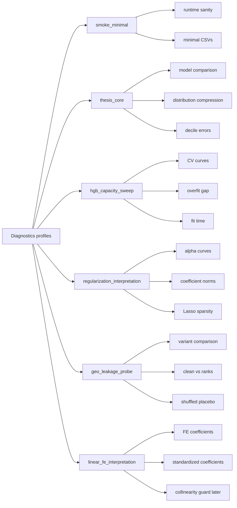

# Experiment registry

This registry maps experiment configs to their scientific role and diagnostics profile. It is a companion to `configs/experiment_registry.yaml` and exists to make experiment intent legible before a run is launched.

## Governance phrase

Metrics compare.
Diagnostics explain.
Guards protect.
Artifacts remember.

## Experiment table

| experiment_id | file | family | role | sample_regime | models | diagnostics_profile | thesis_section | priority | notes |
|---|---|---|---|---|---|---|---|---|---|
| debug_experiment | `configs/experiment_debug.yaml` | smoke | smoke | debug_5000 | linear_regression, ridge | smoke_minimal | runtime validation | required | Cheap linear smoke run; not thesis evidence. |
| hgb_debug | `configs/experiment_hgb_debug.yaml` | smoke | smoke | debug_10000 | ridge, hist_gradient_boosting | smoke_minimal | runtime validation | required | Cheap HGB smoke run; not thesis evidence. |
| baseline_income_prediction_v1 | `configs/experiment_baseline.yaml` | thesis_core | benchmark | full | linear_regression, ridge, lasso, hist_gradient_boosting, mlp | thesis_core | core predictive comparison | required | Main baseline comparison across model families. |
| hgb_quick_benchmark_v1 | `configs/experiment_hgb_quick_benchmark.yaml` | thesis_core | benchmark | sweep_100000 | hist_gradient_boosting | thesis_core | core predictive comparison | useful | Fast stable HGB benchmark with clean geography. |
| hgb_quick_clean_geo_v1 | `configs/experiment_hgb_quick_clean_geo_v1.yaml` | thesis_core | benchmark | sweep_5000 | hist_gradient_boosting | thesis_core | core predictive comparison; geography leakage anchor | required | Conservative clean-geography anchor for the geo probe. |
| regularization_sweep_v1 | `configs/experiment_regularization_sweep.yaml` | regularization | sweep | full_50000 | linear_regression, ridge, lasso | regularization_interpretation | why not linear | useful | Interprets whether regularization changes the linear frontier. |
| hgb_pilot_v1 | `configs/experiment_hgb_pilot.yaml` | hgb_tuning | optional | debug_20000 | ridge, hist_gradient_boosting | hgb_capacity_sweep | why this HGB benchmark | optional | Optional pilot tuning run. |
| hgb_sweep_v1 | `configs/experiment_hgb_sweep.yaml` | hgb_tuning | sweep | sweep_100000 | hist_gradient_boosting | hgb_capacity_sweep | why this HGB benchmark | optional | Broad HGB grid; expensive and not thesis-core. |
| hgb_leaf_capacity_sweep_v1 | `configs/experiment_hgb_leaf_capacity_sweep.yaml` | hgb_tuning | sweep | sweep_100000 | hist_gradient_boosting | hgb_capacity_sweep | why this HGB benchmark | useful | Single-parameter max_leaf_nodes sweep. |
| hgb_min_leaf_sweep_v1 | `configs/experiment_hgb_min_leaf_sweep.yaml` | hgb_tuning | sweep | sweep_100000 | hist_gradient_boosting | hgb_capacity_sweep | why this HGB benchmark | useful | Single-parameter min_samples_leaf sweep. |
| hgb_lr_iter_sweep_v1 | `configs/experiment_hgb_lr_iter_sweep.yaml` | hgb_tuning | sweep | sweep_100000 | hist_gradient_boosting | hgb_capacity_sweep | why this HGB benchmark | useful | Learning-rate by iteration-budget sweep. |
| hgb_l2_sweep_v1 | `configs/experiment_hgb_l2_sweep.yaml` | hgb_tuning | sweep | sweep_100000 | hist_gradient_boosting | hgb_capacity_sweep | why this HGB benchmark | useful | HGB L2 regularization sweep. |
| hgb_quick_no_geo_v1 | `configs/experiment_hgb_quick_no_geo_v1.yaml` | geo_probe | robustness | sweep_5000 | hist_gradient_boosting | geo_leakage_probe | feature validity and leakage risk | useful | Removes geography to estimate clean geography contribution. |
| hgb_quick_with_geo_ranks_v1 | `configs/experiment_hgb_quick_with_geo_ranks_v1.yaml` | geo_probe | robustness | sweep_5000 | hist_gradient_boosting | geo_leakage_probe | feature validity and leakage risk | useful | Adds leakage-suspect geographic rank variables. |
| hgb_quick_shuffled_geo_ranks_v1 | `configs/experiment_hgb_quick_shuffled_geo_ranks_v1.yaml` | geo_probe | robustness | sweep_5000 | hist_gradient_boosting | geo_leakage_probe | feature validity and leakage risk | useful | Placebo variant with shuffled geographic rank mappings. |
| linear_region_fe_v1 | `configs/experiment_linear_region_fe_v1.yaml` | fixed_effects | interpretability | sweep_5000 | linear_regression, ridge | linear_fe_interpretation | why not linear | useful | Region fixed-effect interpretation. |
| linear_aglo_fe_v1 | `configs/experiment_linear_aglo_fe_v1.yaml` | fixed_effects | interpretability | sweep_5000 | linear_regression, ridge | linear_fe_interpretation | why not linear | useful | AGLOMERADO fixed-effect interpretation. |
| linear_year_fe_v1 | `configs/experiment_linear_year_fe_v1.yaml` | fixed_effects | interpretability | sweep_5000 | linear_regression, ridge | linear_fe_interpretation | why not linear | useful | Year fixed-effect interpretation. |
| linear_quarter_fe_v1 | `configs/experiment_linear_quarter_fe_v1.yaml` | fixed_effects | interpretability | sweep_5000 | linear_regression, ridge | linear_fe_interpretation | why not linear | useful | Quarter fixed-effect interpretation. |
| linear_aglo_year_fe_v1 | `configs/experiment_linear_aglo_year_fe_v1.yaml` | fixed_effects | interpretability | sweep_5000 | linear_regression, ridge | linear_fe_interpretation | why not linear | optional | AGLOMERADO by year interaction fixed-effect interpretation. |

## Thesis map

```mermaid
flowchart TD
    Q[Thesis question: how predictable is individual income in EPH?]

    Q --> A[Core predictive comparison]
    A --> A1[experiment_baseline]
    A --> A2[hgb_quick_benchmark]
    A --> A3[hgb_quick_clean_geo]
    A --> A4[profile: thesis_core]

    Q --> B[Distributional error diagnosis]
    B --> B1[observed vs predicted]
    B --> B2[predicted vs observed distribution]
    B --> B3[MAE by income decile]
    B --> B4[mean residual by decile]
    B --> B5[compression summary]

    Q --> C[Why not linear?]
    C --> C1[regularization_sweep]
    C --> C2[linear FE experiments]
    C --> C3[profile: regularization_interpretation]
    C --> C4[profile: linear_fe_interpretation]

    Q --> D[Why this HGB benchmark?]
    D --> D1[leaf capacity sweep]
    D --> D2[min leaf sweep]
    D --> D3[learning rate x iter sweep]
    D --> D4[L2 sweep]
    D --> D5[profile: hgb_capacity_sweep]

    Q --> E[Feature validity and leakage risk]
    E --> E1[clean geo]
    E --> E2[no geo]
    E --> E3[with geo ranks]
    E --> E4[shuffled geo ranks]
    E --> E5[profile: geo_leakage_probe]

    Q --> F[Runtime validation]
    F --> F1[debug]
    F --> F2[hgb_debug]
    F --> F3[profile: smoke_minimal]
```

## Diagnostics profile map

